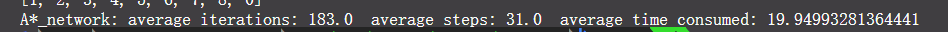
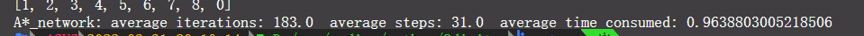
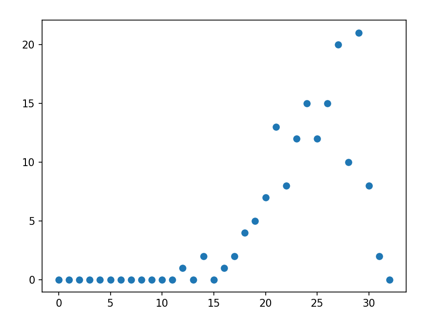
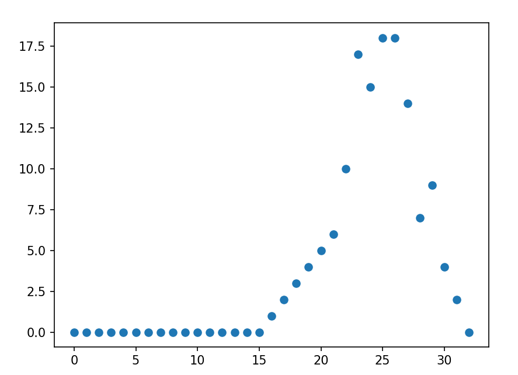
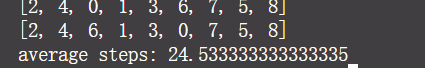
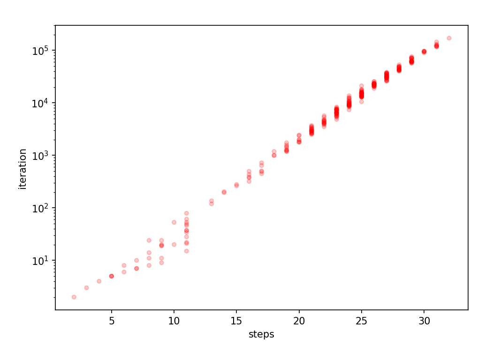
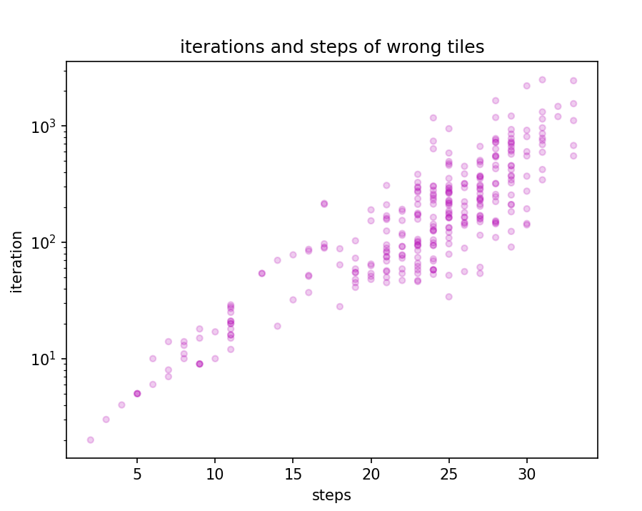
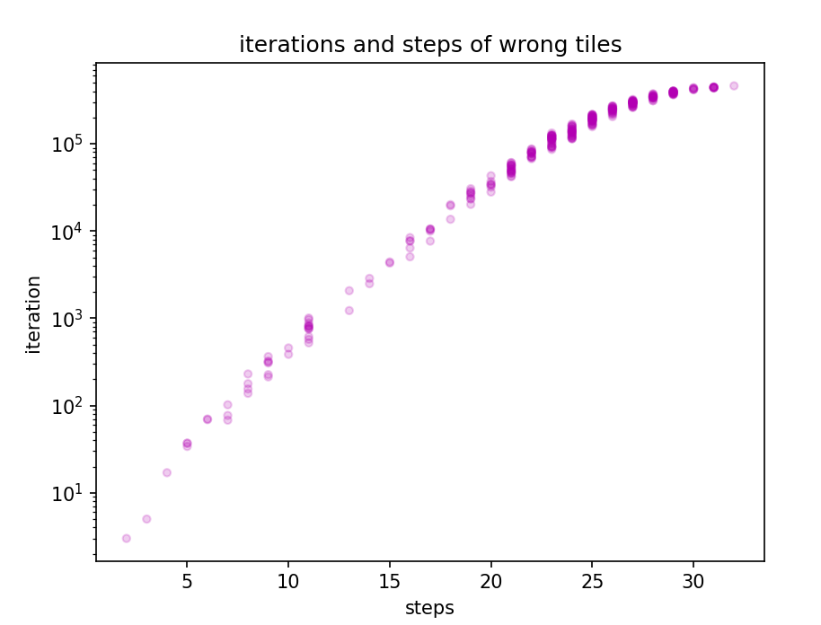
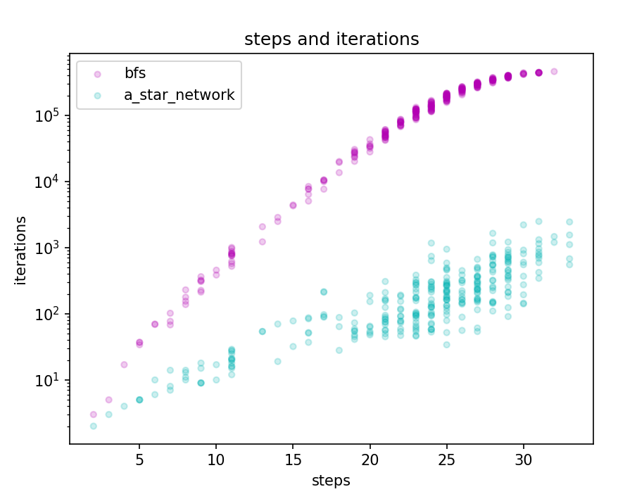

## tensorflow 速度慢

尝试以下解决方法
https://stackoverflow.com/questions/62681257/tf-keras-model-predict-is-slower-than-straight-numpy

关闭eager mode：

`tf.compat.v1.disable_eager_execution()`

https://towardsdatascience.com/accelerate-your-training-and-inference-running-on-tensorflow-896aa963aa70

尝试model puring

## 网络不好收敛

## 网络过拟合

## 抽取数据缺乏代表性

抽样300次最优解步数

错误状态，iteration和step

用的神经网络

[1]许精明,阮越.基于量子衍生算法的8-puzzle问题分析[J].量子电子学报,2015,32(04):459-465.

| 搜索算法      | 平均生成节点 | 平均用时s | 结果平均步数 |
| ------------- | ------------ | --------- | ------------ |
| BFS           | 169826.3     | 0.96      | 22.51        |
| DFS           | 94295.9      | 17.14     | 50340.0      |
| GREEDY        | 155267.0     | 1.24      | 22.51        |
| A* MANHATTAN  | 1717.2       | 0.02      | 22.51        |
| A* WONG TILES | 21391.3      | 0.19      | 22.51        |
| A* NETWORK    | 281.1        | 0.38      | 22.94        |
|               |              |           |              |

